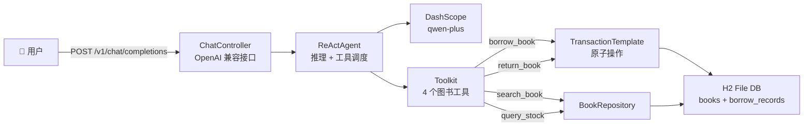

# Smart Library Agent

基于 **Spring Boot + AgentScope** 的智能图书馆助手，采用 ReAct 架构实现大模型动态 Tool Calling，以 JPA + H2 保证数据事务一致性。

[](https://adoptium.net/)
[](https://spring.io/projects/spring-boot)
[](https://github.com/agentscope-ai/agentscope-java)
[](https://www.h2database.com/)

## 核心亮点

- **ReAct 推理 + 动态 Tool Calling** — Agent 自主判断用户意图，在 `search_book` / `query_stock` / `borrow_book` / `return_book` 四个工具间自动调度
- **JPA 事务一致性** — 借书（改状态 + 建记录）和还书（改状态 + 补归还时间）均在 `TransactionTemplate` 中原子执行，杜绝 AI 自动操作中的数据不一致
- **零配置持久化** — H2 文件数据库，重启不丢数据，无需安装外部数据库
- **OpenAI 兼容 API** — `POST /v1/chat/completions`，可直接接入任何兼容 OpenAI 协议的前端或工具链

## 架构



## 技术栈

| 层级 | 技术 |
|------|------|
| 框架 | Spring Boot 4.0.4 |
| LLM | DashScope (qwen-plus) |
| Agent | AgentScope Core (ReActAgent) |
| 持久化 | Spring Data JPA + H2 File Database |
| 事务 | TransactionTemplate 编程式事务 |
| 语言 | Java 17 |
| 构建 | Maven |

## 快速启动

### Docker（推荐）

```bash
git clone https://github.com/yelaing/smart-library-agent.git
cd smart-library-agent

# 复制环境变量模板，填入你的 DashScope API Key
cp .env.example .env
# 编辑 .env，设置 DASHSCOPE_API_KEY=你的key

# 一键启动
docker-compose up -d
```

### 本地 Maven

```bash
git clone https://github.com/yelaing/smart-library-agent.git
cd smart-library-agent

# 用 H2 内置数据库开发模式启动（无需 MySQL）
mvn spring-boot:run -Dspring-boot.run.profiles=dev

# Windows 设置 API Key
set DASHSCOPE_API_KEY=sk-your-dashscope-api-key
```

### 验证

```bash
# 健康检查
curl -X POST http://localhost:8080/api/health

# 流式对话
curl -X POST http://localhost:8080/v1/chat/completions \
  -H "Content-Type: application/json" \
  -d '{"model":"qwen-plus","stream":true,"messages":[{"role":"user","content":"搜索Spring相关的书"}]}'

# 完整借还流程
curl -X POST http://localhost:8080/v1/chat/completions \
  -H "Content-Type: application/json" \
  -d '{"model":"qwen-plus","messages":[{"role":"user","content":"借阅ISBN 9787111636996，借阅人张三"}]}'

curl -X POST http://localhost:8080/v1/chat/completions \
  -H "Content-Type: application/json" \
  -d '{"model":"qwen-plus","messages":[{"role":"user","content":"归还ISBN 9787111636996"}]}'
```

### 运行测试

```bash
mvn test
```

## API 接口

| 方法 | 路径 | 说明 |
|------|------|------|
| POST | `/v1/chat/completions` | OpenAI 兼容对话接口 |
| POST | `/api/health` | 健康检查 |

## Agent 工具集

| 工具 | 说明 | 示例 |
|------|------|------|
| `search_book` | 按书名关键词模糊搜索 | "搜索Spring相关的书" |
| `query_stock` | 按 ISBN 精确查库存 | "查ISBN 9787111636996" |
| `borrow_book` | 借阅图书（含事务） | "借阅ISBN xxx，借阅人张三" |
| `return_book` | 归还图书（含事务） | "归还ISBN xxx" |

## 数据库

首次启动自动创建 `books` 和 `borrow_records` 表，并插入 5 本种子图书。H2 数据文件位于 `data/library.mv.db`，重启不丢失。

## 项目结构

```
src/main/java/com/library/agent/
├── LibraryAgentApplication.java    # 启动类
├── config/
│   ├── AgentConfig.java            # ReActAgent 手动组装
│   ├── DataInitializer.java        # 种子数据初始化
│   └── GlobalExceptionHandler.java # 全局异常处理
├── controller/
│   └── ChatController.java         # OpenAI 兼容 REST API
├── dto/
│   ├── ChatRequest.java            # 请求 DTO
│   └── ChatResponse.java           # 响应 DTO
├── entity/
│   ├── Book.java                   # 图书 JPA 实体
│   ├── BookStatus.java             # 图书状态枚举
│   └── BorrowRecord.java           # 借阅记录 JPA 实体
├── repository/
│   ├── BookRepository.java         # 图书 JPA 仓库
│   └── BorrowRecordRepository.java # 借阅记录 JPA 仓库
└── tools/
    └── LibraryTool.java            # 4 个 @Tool，含事务控制

src/test/java/com/library/agent/
├── LibraryAgentApplicationTests.java   # 端到端测试
├── controller/
│   └── ChatControllerTest.java         # API 集成测试
└── tools/
    └── LibraryToolTest.java            # 工具单元测试
```

## License

MIT
