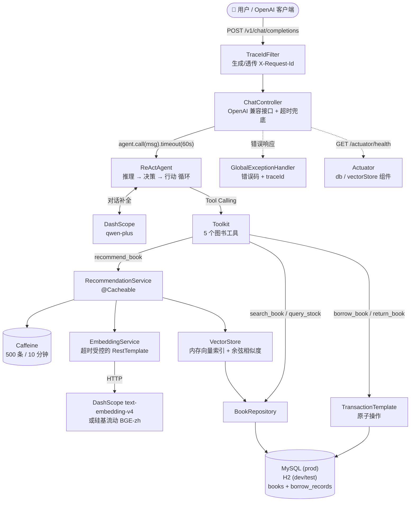

# Smart Library Agent

基于 **Spring Boot + AgentScope** 的智能图书馆助手。用 ReAct 架构让大模型自主调度五个图书工具，内置基于向量检索的语义推荐（RAG），并提供 OpenAI 兼容的对话接口。

[](https://github.com/yelaing/smart-library-agent/actions/workflows/ci.yml)
[](https://adoptium.net/)
[](https://spring.io/projects/spring-boot)
[](https://github.com/agentscope-ai/agentscope-java)
[](#测试与代码质量)

## 核心亮点

- **RAG 语义推荐** —— 图书简介经 Embedding 向量化后存内存索引，用户说"想学并发编程"时按余弦相似度检索最相关的馆藏，而不是做关键词匹配
- **ReAct 推理 + 5 Tool Calling** —— Agent 自主判断意图，在 `recommend_book` / `search_book` / `query_stock` / `borrow_book` / `return_book` 之间调度
- **事务一致性** —— 借书（改状态 + 建记录）与还书（改状态 + 补归还时间）在 `TransactionTemplate` 中原子执行
- **OpenAI 兼容 API** —— `POST /v1/chat/completions` 支持流式与非流式，可直接接入任何兼容 OpenAI 协议的前端
- **工程化** —— CI（编译 / Checkstyle / 测试 / 覆盖率门禁 / 镜像构建）、多阶段 Docker、Swagger UI、Actuator、traceId 贯穿日志、90%+ 测试覆盖

## 架构


```mermaid
flowchart TD
    User(["👤 用户 / OpenAI 客户端"]) -->|"POST /v1/chat/completions"| Filter["TraceIdFilter<br/>生成/透传 X-Request-Id"]
    Filter --> API["ChatController<br/>OpenAI 兼容接口 + 超时兜底"]
    API -->|"agent.call(msg).timeout(60s)"| Agent["ReActAgent<br/>推理 → 决策 → 行动 循环"]
    Agent <-->|对话补全| LLM["DashScope<br/>qwen-plus"]
    Agent -->|Tool Calling| Toolkit["Toolkit<br/>5 个图书工具"]

    Toolkit -->|recommend_book| Rec["RecommendationService<br/>@Cacheable"]
    Rec --> Cache[("Caffeine<br/>500 条 / 10 分钟")]
    Rec --> Emb["EmbeddingService<br/>超时受控的 RestTemplate"]
    Emb -->|"HTTP"| EmbAPI["DashScope text-embedding-v4<br/>或硅基流动 BGE-zh"]
    Rec --> Vec["VectorStore<br/>内存向量索引 + 余弦相似度"]

    Toolkit -->|search_book / query_stock| Repo["BookRepository"]
    Toolkit -->|borrow_book / return_book| Tx["TransactionTemplate<br/>原子操作"]
    Vec --> Repo
    Tx --> DB[("MySQL (prod)<br/>H2 (dev/test)<br/>books + borrow_records")]
    Repo --> DB

    API -.->|错误响应| ErrHandler["GlobalExceptionHandler<br/>错误码 + traceId"]
    API -.->|"GET /actuator/health"| Actuator["Actuator<br/>db / vectorStore 组件"]
```
> 图中除 `Agent → LLM → Toolkit` 构成 ReAct 循环（推理、调用工具、再推理直至给出回答）外，其余均为单向调用。

## 技术选型理由

| 选择 | 理由 |
|------|------|
| **AgentScope** 而非 Spring AI / LangChain4j | 原生 Java ReAct 实现，工具注册模型清晰；不引入 Python 侧依赖 |
| **H2 (dev/test) + MySQL (prod) 双栈** | 本地零依赖即可开发调试（H2 文件库，重启不丢数据），生产走 MySQL 并显式配置连接池 |
| **Caffeine** 而非 Redis | 向量索引本身就在 JVM 内（`VectorStore` 是内存 Map），缓存与之一致放在进程内；引入 Redis 会带来与单实例架构不匹配的额外基础设施 |
| **独立 `RecommendationService`** | `LibraryTool` 由 `AgentConfig` 手工 `new` 出来、不是容器管理的 Bean，`@Cacheable` 对它不生效（Spring AOP 只代理 Bean）。把推荐逻辑抽成 `@Service` 后缓存才真正工作，业务逻辑也能绕开 LLM 单测 |
| **`TransactionTemplate`** 而非 `@Transactional` | 工具类非 Spring Bean，注解式事务同样不生效；编程式事务语义显式、不依赖代理 |
| **Checkstyle 务实规则集** | 只拦截命名、导入、括号、复杂度等真问题；不强制 Javadoc、放行测试的 given-when-then 下划线命名与紧凑访问器写法 |

## 快速开始

### 方式一：Docker Compose（一键启动，含 MySQL）

```bash
git clone https://github.com/yelaing/smart-library-agent.git
cd smart-library-agent

cp .env.example .env
# 编辑 .env，至少填入 DASHSCOPE_API_KEY

docker-compose up -d
```

启动后：

| 地址 | 说明 |
|------|------|
| http://localhost:8080/swagger-ui.html | 接口文档与在线调试 |
| http://localhost:8080/actuator/health | 健康检查（含数据库与向量索引状态） |
| http://localhost:8080/actuator/metrics | 指标（JVM、HikariCP、缓存等） |

> 未填 API Key 也能启动：查书、借还书功能正常，只有对话与语义推荐不可用。

### 方式二：本地 Maven（H2 文件库，无需 MySQL）

```bash
# 默认就是 dev profile，走 H2 文件库
mvn spring-boot:run

# 或者显式指定
mvn spring-boot:run -Dspring-boot.run.profiles=dev
```

Windows 下也可直接双击 `start.bat`（会自动设置 dev profile 并打开浏览器）。

开发模式下 H2 控制台位于 http://localhost:8080/h2-console （JDBC URL `jdbc:h2:file:./data/library`，用户名 `sa`，密码留空）。

### 验证

```bash
# 健康检查
curl http://localhost:8080/actuator/health

# 非流式对话
curl -X POST http://localhost:8080/v1/chat/completions \
  -H "Content-Type: application/json" \
  -d '{"model":"qwen-plus","messages":[{"role":"user","content":"搜索 Spring 相关的书"}]}'

# 流式对话（SSE，以 [DONE] 结束）
curl -N -X POST http://localhost:8080/v1/chat/completions \
  -H "Content-Type: application/json" \
  -d '{"model":"qwen-plus","stream":true,"messages":[{"role":"user","content":"想学并发编程，推荐几本书"}]}'

# 借书 → 还书（走事务）
curl -X POST http://localhost:8080/v1/chat/completions \
  -H "Content-Type: application/json" \
  -d '{"model":"qwen-plus","messages":[{"role":"user","content":"借阅 ISBN 9787111636996，借阅人张三"}]}'
curl -X POST http://localhost:8080/v1/chat/completions \
  -H "Content-Type: application/json" \
  -d '{"model":"qwen-plus","messages":[{"role":"user","content":"归还 ISBN 9787111636996"}]}'
```

## API 说明

| 方法 | 路径 | 说明 |
|------|------|------|
| POST | `/v1/chat/completions` | OpenAI 兼容对话接口，`stream` 控制流式 |
| POST | `/api/health` | 轻量健康检查（返回服务名与 agent 名） |
| GET | `/actuator/health` | 完整健康检查：`db`、`diskSpace`、`vectorStore` 等组件 |
| GET | `/actuator/metrics` | 指标列表，如 `cache.size`、`hikaricp.connections` |
| GET | `/v3/api-docs` | OpenAPI 3 文档（JSON） |
| GET | `/swagger-ui.html` | Swagger UI |

### 请求示例

```json
{
  "model": "qwen-plus",
  "stream": false,
  "messages": [
    {"role": "user", "content": "想学并发编程，推荐几本书"}
  ]
}
```

### 错误响应

所有错误统一为如下结构，`traceId` 与日志中的 `[traceId]` 一一对应，便于按 id 定位问题：

```json
{
  "timestamp": "2026-09-24T05:20:00Z",
  "status": 400,
  "code": 40001,
  "error": "Bad Request",
  "message": "messages 不能为空",
  "traceId": "a1b2c3d4e5f60718",
  "path": "/v1/chat/completions"
}
```

| 错误码 | HTTP | 触发场景 |
|--------|------|----------|
| `40001` INVALID_REQUEST | 400 | `messages` 为空，或最后一条用户消息内容为空白 |
| `50401` AGENT_TIMEOUT | 504 | Agent 调用超过 `library.chat.timeout`（默认 60s） |
| `50000` INTERNAL_ERROR | 500 | 未预期的服务端异常（对外只给统一话术，细节仅进日志） |

## Agent 工具集

| 工具 | 说明 | 示例提问 |
|------|------|----------|
| `recommend_book` | 语义检索推荐（RAG） | "想学并发编程的书" |
| `search_book` | 按书名关键词模糊搜索 | "搜索 Spring 相关的书" |
| `query_stock` | 按 ISBN 精确查库存与位置 | "查 ISBN 9787111636996" |
| `borrow_book` | 借阅图书（事务） | "借阅 ISBN xxx，借阅人张三" |
| `return_book` | 归还图书（事务） | "归还 ISBN xxx" |

## 配置管理

配置按环境拆分，敏感信息全部走环境变量：

| 文件 | 用途 | 数据源 |
|------|------|--------|
| `application.yml` | 公共配置（端口、Cache、Actuator、springdoc、Agent 提示词） | — |
| `application-dev.yml` | 本地开发（`spring.profiles.default` 指向它） | H2 文件库 `./data/library` |
| `application-prod.yml` | 生产 | MySQL，读取 `DB_*` 环境变量 |
| `application-test.yml` | 测试（关闭向量初始化，全离线） | H2 内存库 |

常用环境变量（见 `.env.example`）：

| 变量 | 必填 | 默认 | 说明 |
|------|:---:|------|------|
| `DASHSCOPE_API_KEY` | 是 | — | 百炼 API Key，对话与默认 Embedding 依赖它 |
| `SILICONFLOW_API_KEY` | 否 | 空 | 填入后切换到硅基流动 BGE 中文向量模型 |
| `DB_HOST` / `DB_PORT` / `DB_NAME` | 否 | `localhost` / `3306` / `library` | MySQL 连接（prod） |
| `DB_USERNAME` / `DB_PASSWORD` | 否 | `root` / `root` | MySQL 凭据（prod） |
| `DB_POOL_SIZE` | 否 | `10` | HikariCP 最大连接数 |
| `MYSQL_PASSWORD` | 否 | `root` | docker-compose 中 MySQL root 密码 |
| `SERVER_PORT` | 否 | `8080` | 服务端口 |

可调的应用参数：

| 配置项 | 默认 | 说明 |
|--------|------|------|
| `library.chat.timeout` | `60s` | Agent 单次调用超时上限 |
| `library.embedding.connect-timeout` | `5s` | Embedding 接口连接超时 |
| `library.embedding.read-timeout` | `15s` | Embedding 接口读超时 |
| `library.vector-init.enabled` | `true` | 是否在启动时构建向量索引 |
| `spring.cache.caffeine.spec` | `maximumSize=500,expireAfterWrite=10m` | 推荐缓存容量与 TTL |

## 数据库

启动时通过 JPA 自动建表并插入 5 本种子图书（仅当表为空）。

- `books`：`isbn` 唯一索引；`title` **刻意不建索引** —— 检索走 `findByTitleContaining` 生成 `LIKE '%关键词%'`，前导通配符无法命中 B-tree 索引
- `borrow_records`：`(book_id, return_date)` 复合索引，服务于还书时的查询

## 测试与代码质量

```bash
mvn test      # 只跑测试
mvn verify    # 编译 + Checkstyle + 测试 + 覆盖率门禁 + 打包（CI 执行的完整流程）
```

| 项 | 现状 |
|------|------|
| 测试数量 | 74 |
| 行覆盖率 | **97.2%**（310/319，排除 dto / entity / 启动类） |
| 覆盖率门禁 | 行覆盖 < 80% 则构建失败（`mvn verify`） |
| 代码风格 | Checkstyle 10.26.1，规则集见 `config/checkstyle/checkstyle.xml`，0 违规 |

测试覆盖：工具方法、余弦相似度排序算法、推荐缓存是否真正生效（跨 Bean 验证 `@Cacheable`）、Embedding 双 provider 分支与失败路径、向量索引构建、工具集完整性、traceId 过滤器、全局异常处理，以及基于 MockMvc 的端到端接口测试（Actuator / OpenAPI / 对话 / SSE 流 / 错误体）。测试全程离线，不依赖外部 API。

覆盖率报告生成在 `target/site/jacoco/index.html`。

## 项目结构

```
├── .github/workflows/ci.yml        # CI：verify + 镜像构建
├── config/checkstyle/              # Checkstyle 规则集
├── Dockerfile                      # 多阶段构建，非 root 运行，内置 HEALTHCHECK
├── docker-compose.yml              # app + mysql，一键启动
├── src/main/java/com/library/agent/
│   ├── LibraryAgentApplication.java
│   ├── config/
│   │   ├── AgentConfig.java             # ReActAgent 手动组装（模型/记忆/工具）
│   │   ├── CacheConfig.java             # @EnableCaching
│   │   ├── TraceIdFilter.java           # traceId 生成/MDC/回写响应头
│   │   ├── RestTemplateConfig.java      # 带超时的 HTTP 客户端
│   │   ├── OpenApiConfig.java           # OpenAPI 元信息
│   │   ├── GlobalExceptionHandler.java  # 统一异常 + 错误码
│   │   └── DataInitializer.java         # 种子数据
│   ├── controller/ChatController.java   # OpenAI 兼容接口 + 超时兜底
│   ├── dto/                             # ChatRequest / ChatResponse / ErrorResponse
│   ├── entity/                          # Book / BookStatus / BorrowRecord
│   ├── exception/                       # ErrorCode / AgentTimeoutException
│   ├── health/                          # VectorStoreHealthIndicator
│   ├── repository/                      # JPA 仓库
│   ├── service/
│   │   ├── RecommendationService.java   # 语义推荐 + 缓存
│   │   ├── EmbeddingService.java        # 文本向量化（双 provider）
│   │   ├── VectorStore.java             # 内存向量索引 + 余弦相似度
│   │   └── VectorInitService.java       # 启动时构建索引
│   └── tools/LibraryTool.java           # 5 个 @Tool，LLM 参数适配层
├── src/main/resources/
│   ├── application*.yml                 # 多环境配置
│   ├── logback-spring.xml               # 控制台 + 滚动文件，含 traceId
│   └── static/index.html                # 内置调试页面
└── src/test/java/com/library/agent/     # 单元测试 + 集成测试
```

## 已知取舍

- **向量索引在内存中**：适合当前单实例规模。图书量级增长或需要多实例共享时，应换成向量数据库（如 pgvector / Milvus）
- **缓存为进程内 Caffeine**：多实例部署时各实例缓存独立，一致性弱于集中式缓存
- **MDC 不跨线程**：SSE 流式分片的日志不带 traceId（流在 `boundedElastic` 线程产出），请求入口与出口日志正常
- **`ChatController` 尚有 8 行未覆盖**：SSE 分片序列化与错误兜底分支需要构造 AgentScope 内部的 chunk 对象，为避免测试与第三方内部实现强耦合，未强行覆盖
